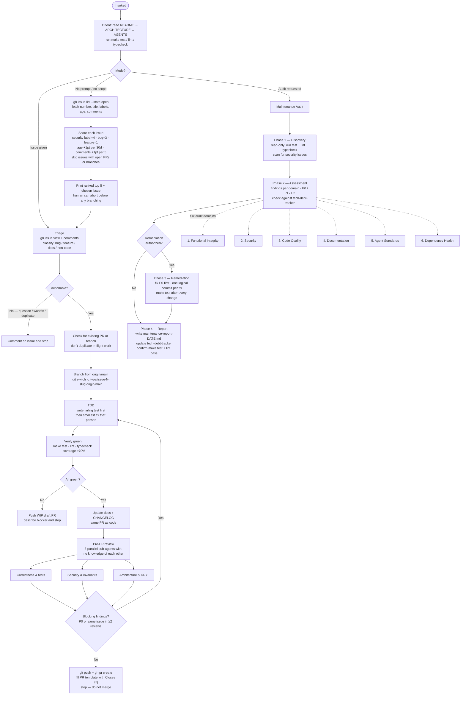

<!-- last_verified: 2026-07-10 -->
# Maintainer Agent

The `genblaze-maintainer` is an autonomous Claude Code agent that operates as the repo's primary guardian. It runs in an isolated git worktree with edit permissions and handles three distinct modes: resolving a specific GitHub issue end-to-end, autonomously discovering and fixing the highest-priority open issue when invoked with no prompt, or running a broad maintenance audit across six quality domains.

- **Agent definition**: `.claude/agents/genblaze-maintainer.md`
- **Checklists**: `.claude/agents/genblaze-maintainer/checklists/`
- **Isolation**: `worktree` — each run gets a clean copy of the repo; no shared state with other agents

---

## Mode Routing

The first thing the agent decides is which mode it's in. These modes are mutually exclusive — audit logic never bleeds into an issue fix.

| Invocation | Mode |
|---|---|
| `#70`, issue URL, "fix issue…" | Issue Resolution |
| No prompt, no issue, no scope | Autonomous Triage |
| "audit", "scan", "check the repo" | Maintenance Audit |

---

## Flow

---

## Autonomous Triage Protocol

When invoked with no prompt, no issue number, and no audit scope, the agent discovers and prioritizes work itself:

1. **Fetch** all open issues via `gh issue list --state open --json number,title,labels,createdAt,body,comments`.
2. **Score** each issue:
   - Label weight: `security` (4pts) > `bug` (3pts) > `enhancement`/`feature` (1pt) > unlabeled (0pts)
   - Age: +1pt per 30 days open, capped at 4pts
   - Comment volume: +1pt per 5 comments, capped at 3pts
   - Issues with an existing open PR or branch are excluded
3. **Output** the ranked top 5 and the chosen issue before touching any code — the human can abort the agent at this point.
4. **Proceed** with the full Issue Resolution Protocol on the selected issue.

Tie-breaking: equal score → older issue wins; still tied → more comments wins.

---

## Issue Resolution Protocol

Steps map directly to the agent definition's numbered contract:

1. **Triage** — fetch issue + comments; classify and reproduce. Stop without coding if it's a question, wontfix, or duplicate.
2. **Don't duplicate work** — check `gh pr list` and `git branch -a` before touching code.
3. **Branch** — always branch from `origin/main` (worktree HEAD may be stale).
4. **TDD** — failing test first, then smallest idiomatic fix. No opportunistic refactors.
5. **Verify** — `make test`, `make lint`, `make typecheck`, `make coverage` (≥70%). If a Pydantic model changed, regenerate `libs/spec/ts/genblaze.d.ts` via `make ts-types`.
6. **Docs + changelog** — same PR, `[Unreleased]` bullet under the correct package heading.
7. **Commit** — Conventional Commit, imperative subject ≤72 chars, body explains why.
8. **Triangulated review** — three independent sub-agents (correctness, security, architecture). Any P0 or cross-reviewer consensus is blocking; loop back to step 4.
9. **Open PR, stop** — `gh pr create` with `Closes #N`. Never merge, approve, or auto-merge.

---

## Maintenance Audit Domains

| # | Domain | Checklist |
|---|---|---|
| 1 | Functional Integrity | `checklists/functional.md` |
| 2 | Security | `checklists/security.md` |
| 3 | Code Quality | `checklists/code-quality.md` |
| 4 | Documentation | `checklists/documentation.md` |
| 5 | Agent Standards | `checklists/agent-standards.md` |
| 6 | Dependency Health | `checklists/dependencies.md` |

Priority order when remediating: security → functional → code quality → docs → agent standards → deps.

---

## Invariants

The agent must never violate these (inherited from `AGENTS.md`):

- All changes pass `make test`
- Canonical JSON hashing stays deterministic (key sort order, float normalization)
- `canonical_hash` always verifies against re-serialized content
- Provider adapters implement `submit / poll / fetch_output`
- All IDs are UUIDs
- `EmbedPolicy` respected in all embedding paths
- Pydantic v2 models only
- Docs updated in the same PR as code
- Python 3.11+ required
- Providers never store API tokens in manifests
